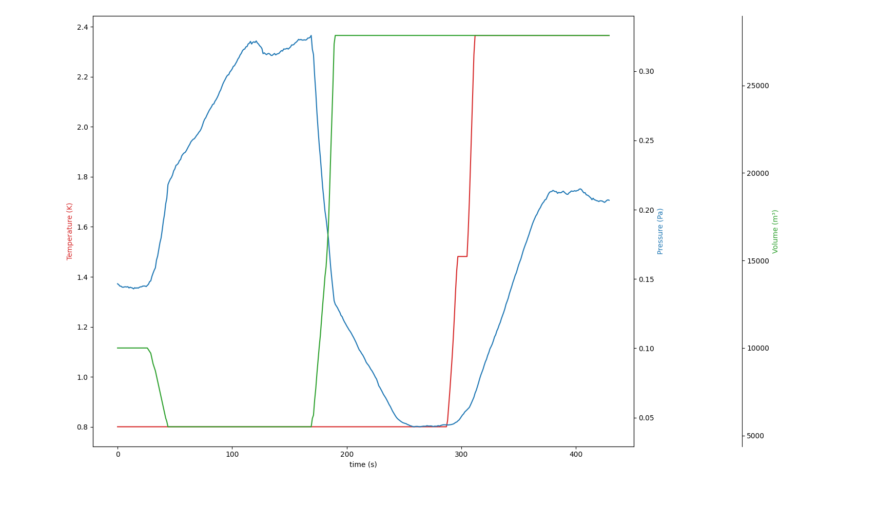

# Thermodynamic Simulator

I wanted to fact-check the claims made by my physics teacher. I can now confirm that $PV$ is kinda constant, and that it is proportional to $nT$. 

It is quire rudimentary and very inefficient but makes nice graphs :

*It might take some time to reach thermodynamic equilibrium, since we don't have a lot of particles, but as you can wee above, it stabilizes at some point.*

## Usage

You can run the simulation by running the `main.py` file. You can change the parameters of the simulation in the `main.py` file, such as the number of particles, the temperature, the volume, etc.

### Performance

Depending on your use case, you might want to switch the collision function in `sim.py` in order to get better performance. The `collision_naive` function is the most accurate, but also the slowest. The `collision_all` function is a bit faster in some contexts, and the `collision_partitioned` function is the fastest, but also the least accurate.

## Issues

 - Pressure measurements are not very accurate as the simulation is quite slow and the particles are not very numerous, and we have to compute an average over a few iterations to get a meaningful value.

 - Heat is simple, but not grounded in real-world constant (we dont use the Boltzmann constant for example)

 - The simulation is quite slow, and the code is not very optimized. It is also quite hard to read, as I did not comment it very well.

